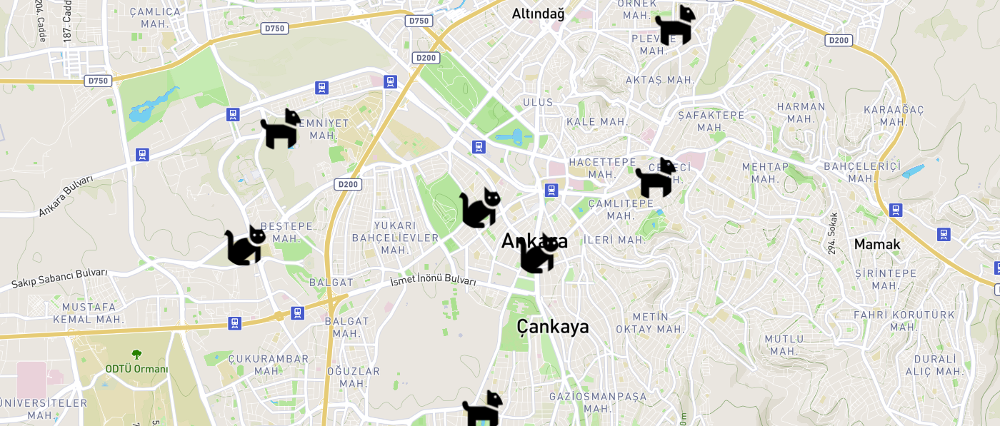

# ZoologicalFooding-main

Restful Api
    
    Spring Boot 
    Hibernate
    Heroku - Heroku Postgresql
    Library -> spring mail, lombok, spring security, spring postgresql.

    Restful API URL's : 
    ________________________________________________________________________
    
    https://restservices496.herokuapp.com/containers
    https://restservices496.herokuapp.com/container/id
    https://restservices496.herokuapp.com/addContainer
    https://restservices496.herokuapp.com/editContainer/id
    https://restservices496.herokuapp.com/deleteContainer/id

    https://restservices496.herokuapp.com/donates
    https://restservices496.herokuapp.com/donate/id
    https://restservices496.herokuapp.com/addDonate
    https://restservices496.herokuapp.com/deleteDonate/id
    https://restservices496.herokuapp.com/editDonate/id
    https://restservices496.herokuapp.com/likeDonate/id
    https://restservices496.herokuapp.com/addDonateProCode

    https://restservices496.herokuapp.com/emails
    https://restservices496.herokuapp.com/email/id
    https://restservices496.herokuapp.com/sendEmail
    https://restservices496.herokuapp.com/deleteEmail/id
    https://restservices496.herokuapp.com/editEmail/id

    https://restservices496.herokuapp.com/comments
    https://restservices496.herokuapp.com/addComment
    https://restservices496.herokuapp.com/likeComment/id
    https://restservices496.herokuapp.com/editComment/id
    https://restservices496.herokuapp.com/deleteComment/id
    

    _________________________________________________________________________
    https://restservices496.herokuapp.com/members    
    https://restservices496.herokuapp.com/member/id  
    https://restservices496.herokuapp.com/addMember
    https://restservices496.herokuapp.com/deleteMember/id
    https://restservices496.herokuapp.com/editMember/id
    
    https://restservices496.herokuapp.com/creditCards
    https://restservices496.herokuapp.com/creditCard/number
    https://restservices496.herokuapp.com/addCreditCard
    https://restservices496.herokuapp.com/deleteCreditCard/number
    https://restservices496.herokuapp.com/editCreditCard/number

    https://restservices496.herokuapp.com/fills
    https://restservices496.herokuapp.com/fill/id
    https://restservices496.herokuapp.com/addFill
    https://restservices496.herokuapp.com/deleteFill/id
    https://restservices496.herokuapp.com/editFill/id

Team Backlog: 

GROUP ZOOLOGICALFOODING
SPRINT PLANNING

SPRINT 1 (21 Jan - 11 Feb)

Barış ÖNEN: 
- Firstly, I will be gathering required hardware components and softwares to implement my part. 
- After that, I will design the circuit with the components and check every component independently if it's working as expected or not. 
- After confirmation, I will start programming Raspberry for Load Cell, HX 711 Load Cell Amplifier, and LCD modules to perform desired actions via Python, Raspbian/Linux OS.

Onur TETIK:
- I will start writing rest api with spring boot. I will establish the spring boot and mysql connection with jdbc and create queries.
- I will write get and post http request links. etc. http:localhost/members, http:localhost/foodcontainer, http:localhost/members?id=1, http:localhost/foodcontainer?id=1.
I will test this links with Postman.

Muharrem Tolga ACAR:
- Creating register and login page 
- Listing all containers in a table
- Update functionalities on table for a specific container

Sukran Guler SAYGILI:
- Creating login page in mobil app
- Listing all containers in a table and
- Listing all users.
- Update functionalities on table for a specific container

SPRINT 2 (11 Feb - 3 March)

Barış Önen:
- I will be programming Raspberry for acquiring location whether using a GPS module like NEO 6M or without a module, and with IP Tracking. 
- After that, I will be storing the location data as I did in Sprint 1 with storing weight. 
- If this part ends quickly I will be moving on to the next step in next Sprint; connecting to the organization's database.

Onur TETIK:
-I will finish all http queries.
-I will check the accuracy of all json objects.
-I will try to show the jsons on the parse map and help my group friend for google maps api.

Muharrem Tolga ACAR:
- Adding a responsive map for listing containers
- Creating a detailed page for container 

Sukran Guler SAYGILI:
Adding a responsive map for listing containers of mobil app.

SPRINT 3 (3 March - 24 March)

Barış Önen:
- I will be programming Raspberry for connecting to the organization's database. As far as I searched; this may be done via using phpmyadmin software using Python, PHP, Mysql, etc...
- After connecting to the database, I will be sending weight and location data to it.
- If I could manage to complete these all objectives earlier than planned, I will be moving on to incomplete or deficient wing of the organization (whether It would be Android, Database or Web Front-End) to help the groupmates.

Onur TETIK:
I will add and remove the remaining API based on system optimization and the latest conditions in google maps api. According to the data from Rasberry, I will update the rest API and test all connections. I will help on the web front end of my group friend.

Muharrem Tolga ACAR:
Adding payment options on the web site

Sukran Guler SAYGILI:
- Adding payment options on the mobile application,
- And adding notification system.

Issues:
https://github.com/ZoologicalFooding/ZoologicalFooding-main/issues/1
https://github.com/ZoologicalFooding/ZoologicalFooding-main/issues/2
https://github.com/ZoologicalFooding/ZoologicalFooding-main/issues/10

https://github.com/ZoologicalFooding/ZoologicalFooding-main/issues/3
https://github.com/ZoologicalFooding/ZoologicalFooding-main/issues/4
https://github.com/ZoologicalFooding/ZoologicalFooding-main/issues/5
https://github.com/ZoologicalFooding/ZoologicalFooding-main/issues/6
https://github.com/ZoologicalFooding/ZoologicalFooding-main/issues/7
https://github.com/ZoologicalFooding/ZoologicalFooding-main/issues/8
https://github.com/ZoologicalFooding/ZoologicalFooding-main/issues/9
