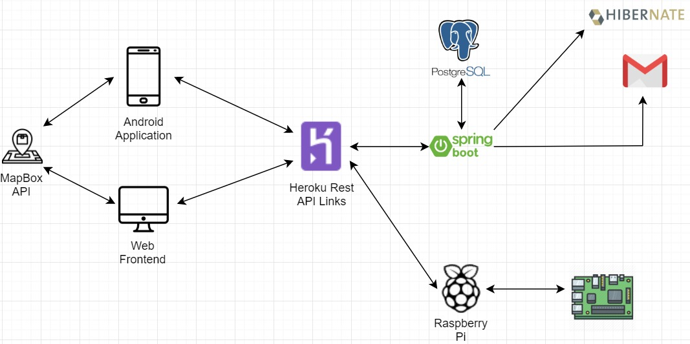

# ZoologicalFooding-main

## What is / How To Use Zoological Fooding ?

This system is created with the purposes of preventing hunger of street animals, and environmental pollution.

You can join and help us to fulfill our purposes by filling our containers, or -if you do not have time for it- just donating to our containers, so a volunteer of us can use that donation to fill our containers with delicious food!

Come, join us. Let's save this planet!

## Get Started !

* [Start From The Rest API](img/herokuRestApiLinks.txt)
* [Start From The Web Page](http://zoological-fooding.herokuapp.com/)
* [Start From The Android App](https://github.com/ZoologicalFooding/ZoologicalFooding-android)
## Developers

* [Muharrem Tolga Acar](https://github.com/TolgaAcar) *Front-End*
* [Şükran Güler Saygılı](https://github.com/SukranSaygili) *Android*
* [Onur Tetik](https://github.com/onurTe) *Back-End / Rest API*
* [Barış Önen](https://github.com/barisonen) *Hardware*

## System Architecture 

## Backlog
* [Backlog](img/backlog.txt)
